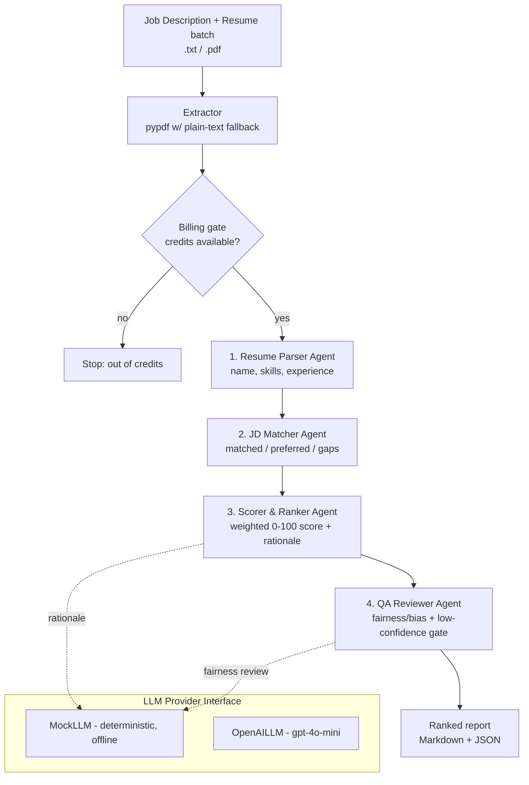

# HR Resume Screening / Candidate Ranking Agent

An autonomous, **monetizable** multi-agent MVP that screens a batch of resumes
against a job description and returns a **ranked** candidate list with per-
candidate match score, matched skills, gaps, and a short rationale — plus a
built-in **fairness/bias QA gate** that flags problematic or low-confidence
matches before release.

> **Runs with zero API keys.** The entire pipeline works end-to-end in
> `LLM_PROVIDER=mock` mode using only the Python standard library. Optional
> dependencies (OpenAI, pypdf, FastAPI, Stripe) enhance it but are never
> required to demonstrate it.

---

## Why this is useful / monetizable

Recruiters and hiring managers spend hours manually reading resumes. This agent
triages a stack of resumes in seconds, ranks them objectively on job-relevant
signals, and produces an audit-friendly report. It is sold per job posting or
per resume screened (see [Monetization](#monetization)).

---

## Architecture

A four-stage multi-agent pipeline with a billing gate in front of paid work:



### Design principle: deterministic core, LLM for narrative

Skill extraction, matching, and scoring are **deterministic** (see
`hr_screening/skills.py`) so results are reproducible and testable without any
network. The LLM (behind `hr_screening/llm.py`) is used to write the natural-
language rationale and a secondary fairness review. In `mock` mode the LLM
returns stable, templated text; in `openai` mode it calls the real model. This
is why the product is fully functional and testable with **no keys**.

### Scoring model

```
score = 100 * (0.70 * required_skill_coverage
             + 0.15 * preferred_skill_coverage
             + 0.15 * experience_fit)
```

`experience_fit = min(candidate_years / jd_min_years, 1.0)`. Candidates are
ranked by score, then confidence, then name (stable ordering).

### Fairness / bias QA gate

The QA agent:

- Detects **protected-attribute reasoning** leaking into a rationale (age,
  gender, race, religion, nationality, disability, family/marital status, sexual
  orientation) and blocks release (`qa_passed = False`).
- Flags **low-confidence** matches for human review.
- Runs a secondary LLM fairness review.

Scoring **never** uses protected attributes — only skills and experience — so a
resume that mentions age/gender/etc. scores identically to one that does not
(this is covered by a test).

---

## Project layout

```
hr_resume_screening_agent/
├── main.py                 # CLI entrypoint (works in mock mode)
├── requirements.txt        # pinned, all OPTIONAL for mock mode
├── .env.example            # copy to .env; defaults need no keys
├── hr_screening/
│   ├── llm.py              # provider interface: MockLLM + OpenAILLM
│   ├── agents.py           # Parser, Matcher, Scorer, QA agents + JD parser
│   ├── pipeline.py         # orchestration + ranking + billing gate
│   ├── skills.py           # deterministic skill/keyword extraction
│   ├── extract.py          # pypdf text extractor w/ plain-text fallback
│   ├── billing.py          # credit system + Stripe checkout stub
│   ├── scheduler.py        # batch mode + FastAPI POST /screen webhook
│   ├── report.py           # Markdown + JSON rendering
│   ├── models.py           # dataclasses
│   └── config.py           # env-driven settings
├── samples/                # 1 JD + 5 resumes
└── tests/                  # pytest suite (passes in mock mode)
```

---

## Quick start (mock mode, no keys)

```bash
cd hr_resume_screening_agent

# Optional: create a venv and install optional extras
python -m venv .venv && . .venv/bin/activate   # or: virtualenv .venv
pip install -r requirements.txt                # optional; mock mode needs none

# Run against the bundled samples — no API key needed
LLM_PROVIDER=mock python main.py
```

You will see a ranked Markdown report. Useful flags:

```bash
python main.py --json                       # JSON output
python main.py --out out/                   # also write out/report.{md,json}
python main.py --jd my_jd.txt --resumes my_folder/
python main.py --estimate                   # estimate cost, don't screen
python main.py --credits 0.05               # enable billing; stops when broke
```

### Using OpenAI (optional)

```bash
export LLM_PROVIDER=openai
export OPENAI_API_KEY=sk-...
python main.py
```

If OpenAI is unavailable, `get_llm` raises a clear error and you can fall back
to `LLM_PROVIDER=mock`.

---

## Automation

### Unattended batch mode

```python
from hr_screening.scheduler import run_batch
report = run_batch("samples/job_description.txt", "samples/resumes", output_dir="out")
```

### FastAPI webhook

```bash
pip install fastapi uvicorn pydantic
python -c "import uvicorn; uvicorn.run('hr_screening.scheduler:build_app', factory=True, port=8000)"
```

```bash
curl -X POST localhost:8000/screen -H 'Content-Type: application/json' -d '{
  "job_description": "Requirements:\n- Python\n- SQL\n",
  "resumes": [{"candidate_id": "a", "text": "Ann - 5 years Python, SQL"}]
}'
```

---

## Monetization

Billing lives in `hr_screening/billing.py`: a prepaid **credit** wallet
(1 credit = 1 USD by default) that is deducted per screened resume. When credits
run out, the pipeline stops cleanly (`OutOfCreditsError`) and returns partial
results.

Two pricing strategies (env `PRICING_STRATEGY`):

| Strategy | Price per resume | When to use |
|----------|------------------|-------------|
| `token`  | `api_cost(tokens) * MARGIN_MULTIPLIER` | Usage-based; scales with resume length |
| `flat`   | `PRICE_PER_RESUME_USD` | Simple, predictable per-resume pricing |

**Margin over API cost.** `api_cost = (tokens / 1000) * PRICE_PER_1K_TOKENS_USD`
(your blended provider cost). The customer price applies `MARGIN_MULTIPLIER`
(default `3.0`), i.e. a 3x markup / ~67% gross margin over raw API cost. Example
packaging:

- **Per job posting:** e.g. $49 flat to screen up to 100 resumes for one role.
- **Per resume:** e.g. $0.50/resume (`flat`) or cost×3 (`token`).

`main.py --estimate` prints the projected cost for a batch before running it.

**Stripe checkout** is stubbed in `create_checkout_session()` and cleanly
disabled unless `STRIPE_API_KEY` is set — no key needed to run. With a key it
creates a real Stripe Checkout Session for buying credits.

---

## Testing / verification

```bash
pip install pytest         # (bundled in requirements.txt)
python -m pytest           # all tests pass in mock mode
```

Tests cover: skill/JD parsing, matching, ranking order, the bias/QA gate,
fairness (protected attributes don't change scores), billing deduction and
out-of-credits behavior, PDF/text extraction fallback, report rendering, and the
webhook endpoint.

---

## Path to production

- **Better extraction:** OCR for scanned PDFs, DOCX support, section-aware
  parsing, and layout-aware chunking.
- **Stronger matching:** embeddings-based semantic skill matching and
  synonym/ontology expansion (ESCO/O*NET) instead of a keyword dictionary.
- **Persistence & multi-tenancy:** a database for accounts, credits, jobs, and
  audit logs; API keys/authn on the webhook; async job queue for large batches.
- **Observability & guardrails:** structured logging, rate limits, retries,
  prompt/version pinning, and evaluation datasets to track quality/fairness
  drift.
- **Real billing:** wire Stripe webhooks for credit top-ups and metered usage.
- **Human-in-the-loop UI:** reviewer dashboard for flagged candidates.

---

## Responsible & fair use

This tool is a **decision-support** aid, not an automated hiring decision maker.
It intentionally scores only job-relevant skills and experience and flags any
rationale that references protected attributes. Even so:

- Always keep a **human in the loop**; treat scores as a first-pass triage.
- Validate the skill vocabulary and weights for **adverse impact** on your
  candidate pools before relying on rankings.
- Comply with applicable law (e.g. EEOC guidance, NYC Local Law 144 bias audits,
  EU AI Act obligations for high-risk hiring systems, GDPR/data-retention).
- Keep audit logs (the JSON report is designed for this) and give candidates
  transparency where required.
