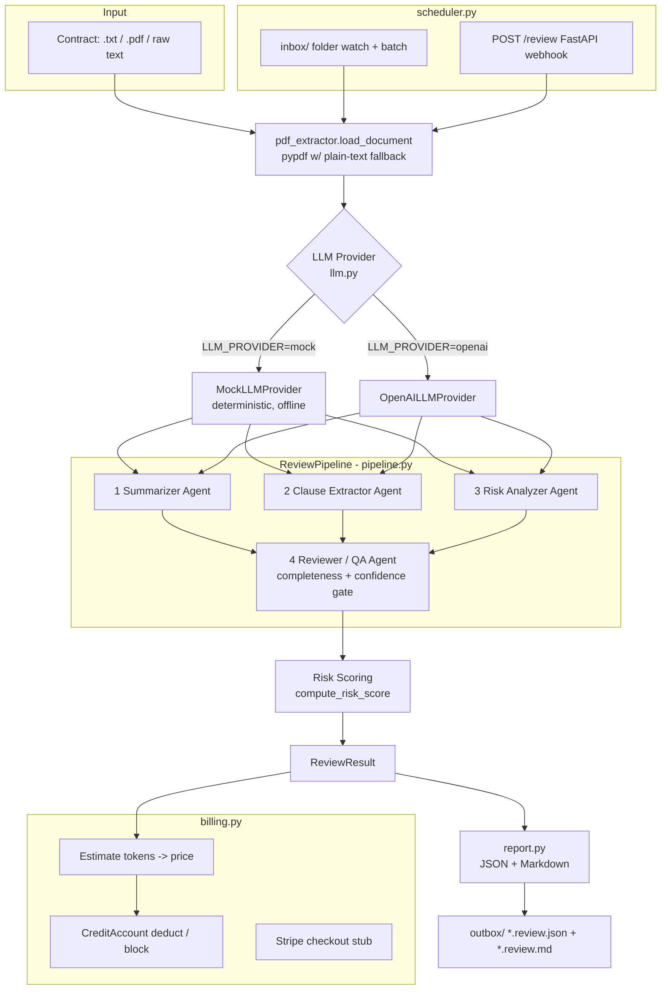

# Legal Document Reviewer Agent

An autonomous, monetizable multi-agent system that reviews contracts and returns
a structured risk assessment (JSON + Markdown). It runs a **Clause Extractor →
Risk Analyzer → Reviewer/QA** pipeline, prices each review through a credit-based
billing layer, and can operate unattended via a folder watcher or a FastAPI
webhook.

> **DISCLAIMER — NOT LEGAL ADVICE.** This software performs automated,
> heuristic/LLM-assisted analysis for informational purposes only. It is **not a
> substitute for a licensed attorney** and does not create an attorney–client
> relationship. Always have a qualified lawyer review any contract before you
> sign, rely on, or act on it. The authors accept no liability for decisions made
> using this tool.

The entire product runs **end-to-end with no API keys** in `mock` mode
(`LLM_PROVIDER=mock`), which is the default. Mock mode performs real,
deterministic keyword/heuristic analysis so you get meaningful output offline.

---

## Architecture



### Agents

| Agent | Responsibility |
| --- | --- |
| **Summarizer** | Produces a business-readable summary of the document. |
| **Clause Extractor** | Identifies key clauses (type, excerpt, confidence). |
| **Risk Analyzer** | Flags risks/red flags with severity, explanation and a suggested change. |
| **Reviewer / QA** | Validates completeness (missing standard clauses), flags low-confidence findings, and gates release with a `needs_human_review` decision. |

The **QA gate** is the safety layer: any low-confidence clause/risk, poor
completeness, or empty extraction sets `needs_human_review = true` so nothing
questionable is released as if it were reliable.

---

## Output shape

`ReviewResult` (see `schemas.py`) serialises to JSON with:

- `document_summary`
- `key_clauses`: list of `{type, excerpt, confidence}`
- `risks`: list of `{title, severity (low|medium|high), explanation, suggested_change, related_clause, confidence}`
- `missing_clauses`: standard clauses not found
- `overall_risk_score`: 0–100
- `risk_level`: low | medium | high
- `qa`: `{passed, completeness_score, flagged_findings, notes, needs_human_review}`
- `token_usage`, `provider`, `document_name`

A rendered Markdown report is also produced by `report.to_markdown`.

---

## Quickstart

```bash
cd legal_doc_reviewer_agent

# 1. (Optional) create a virtualenv and install optional deps.
#    Everything below also works with ZERO deps in mock mode.
python -m venv .venv && source .venv/bin/activate    # or: virtualenv .venv
pip install -r requirements.txt

# 2. Review the sample contract (mock mode, no keys needed).
LLM_PROVIDER=mock python main.py samples/sample_contract.txt

# JSON instead of Markdown:
python main.py samples/sample_contract.txt --format json

# Exercise billing (starting balance in USD):
python main.py samples/sample_contract.txt --credits 5.00
```

### Automation

```bash
# Batch: process everything currently in inbox/ once, write to outbox/.
python scheduler.py batch                # optionally: --credits 10.00

# Watch: poll inbox/ forever (bounded loop available for tests).
python scheduler.py watch

# Webhook: run the FastAPI server (needs fastapi + uvicorn).
python scheduler.py serve --port 8000
# then: curl -X POST localhost:8000/review -H 'content-type: application/json' \
#            -d '{"text": "1. CONFIDENTIALITY ... unlimited liability ..."}'
```

Drop `.txt`/`.pdf`/`.md` files into `inbox/`; results appear in `outbox/` as
`<name>.review.json` and `<name>.review.md`. Processed files are moved to
`inbox/_processed/`, failures to `inbox/_failed/`.

---

## Provider configuration

| `LLM_PROVIDER` | Behaviour | Requirements |
| --- | --- | --- |
| `mock` (default) | Deterministic offline analysis. | None |
| `openai` | Calls OpenAI Chat Completions with a strict JSON contract. | `OPENAI_API_KEY`, `openai` package |

Set variables in `.env` (see `.env.example`). Unknown providers fall back to
mock so the product always runs.

---

## Monetization model

Billing lives in `billing.py`. Each review is priced as:

```
price = flat_fee_per_document + (estimated_tokens / 1000) * price_per_1k_tokens
```

Defaults (configurable via env):

| Setting | Env var | Default |
| --- | --- | --- |
| Flat fee per document | `FLAT_FEE_PER_DOCUMENT` | `$0.50` |
| Customer price / 1k tokens | `PRICE_PER_1K_TOKENS` | `$0.03` |
| Our API cost / 1k tokens | `API_COST_PER_1K_TOKENS` | `$0.005` |

**Worked example (the bundled sample, ~2,900 tokens):**

- Customer price ≈ `0.50 + 2.9 * 0.03` ≈ **$0.587 / document**
- Underlying API cost ≈ `2.9 * 0.005` ≈ **$0.0145**
- **Gross margin ≈ 97%** per review.

Credits are a pre-purchased balance (`CreditAccount`, file-backed via
`CREDITS_FILE`). Every review deducts its price; when the balance is
insufficient the review is **blocked** with `OutOfCreditsError` and the source
file is left in the inbox for retry after top-up.

**Suggested packaging:** sell credit packs (e.g. $25 / $100 / $500), or tiered
subscriptions with a monthly document allowance plus overage priced per the
formula above. Volume/enterprise plans can raise `flat_fee_per_document` for SLA
and human-in-the-loop review of QA-flagged documents.

### Stripe

`billing.create_checkout_session()` is a clean stub. Without `STRIPE_API_KEY` it
returns `{"enabled": false, ...}` and never touches the network. Set
`STRIPE_API_KEY` (and install `stripe`) to create real checkout sessions for
credit top-ups.

---

## Testing

```bash
LLM_PROVIDER=mock pytest
```

Covers: full pipeline in mock mode, clause extraction, risk severities & scoring,
the QA completeness/confidence gate, billing deduction & out-of-credits blocking,
credit persistence, document/PDF loading, batch inbox processing, and the webhook
(skipped automatically if FastAPI is not installed).

---

## Path to production

- **Model quality:** swap `MockLLMProvider` for `openai` (or add Anthropic/local
  providers behind the same `LLMProvider` interface). Add retrieval of a clause
  library and few-shot exemplars per clause type.
- **Grounding & citations:** map every finding to exact character offsets in the
  source and surface page/section references; add a confidence calibration pass.
- **Human-in-the-loop:** route `needs_human_review` documents to a review queue;
  capture attorney edits as training/eval data.
- **Persistence & multi-tenancy:** replace the JSON credit file and file-based
  inbox with Postgres + object storage; add auth, per-tenant keys, audit logs.
- **Billing:** connect the Stripe stub to real products/prices and webhooks;
  meter token usage per tenant; add invoicing and usage caps.
- **Scale:** move batch processing to a queue/worker (e.g. Celery/RQ or a cloud
  queue); containerise the FastAPI service; add rate limiting and observability.
- **Compliance:** data retention controls, PII redaction, encryption at rest, and
  clear disclaimers/consent flows given the legal domain.

---

## Project layout

```
legal_doc_reviewer_agent/
├── main.py            # CLI entry point
├── llm.py             # provider interface: MockLLMProvider + OpenAILLMProvider
├── pipeline.py        # Summarizer, Clause Extractor, Risk Analyzer, Reviewer/QA
├── pdf_extractor.py   # pypdf extraction with plain-text fallback
├── schemas.py         # dataclasses for structured output
├── report.py          # JSON + Markdown rendering
├── billing.py         # credits, per-document pricing, Stripe stub
├── scheduler.py       # inbox batch/watch + FastAPI POST /review
├── config.py          # env-driven settings
├── requirements.txt   # pinned optional deps
├── .env.example
├── samples/sample_contract.txt
├── inbox/  outbox/    # automation drop folders
└── tests/             # pytest suite (passes in mock mode)
```
