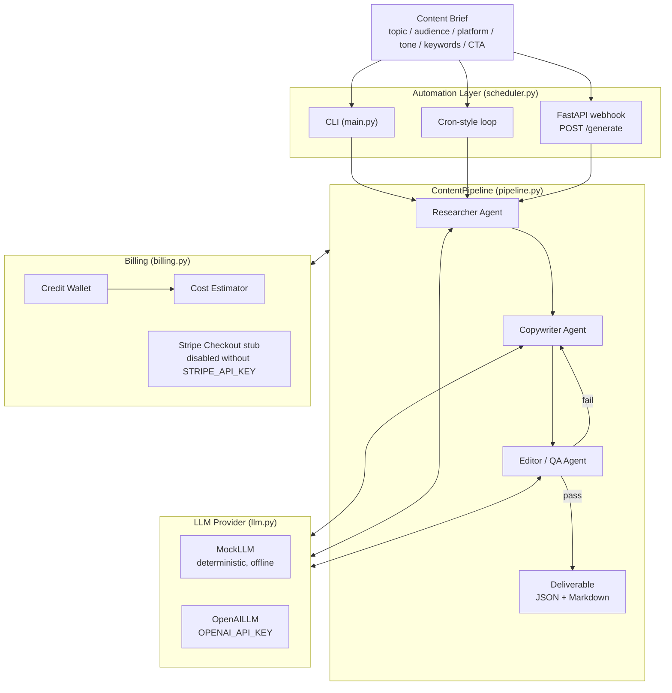

# Marketing Content Generator — Autonomous Multi-Agent MVP

A production-grade MVP that turns a short **content brief** into a full,
QA-validated marketing deliverable: a blog post, platform-native social copy
(Instagram, LinkedIn, X/Twitter), SEO title + meta description, and hashtags.

It runs a **multi-agent pipeline** (Researcher → Copywriter → Editor/QA), meters
usage with a **credit-based billing** system (with a Stripe checkout stub), and
can operate **unattended** via a cron loop or a FastAPI webhook.

> **Zero-config demo:** the entire pipeline runs end-to-end with **no API keys**
> in deterministic MOCK mode (`LLM_PROVIDER=mock`, the default). This is how the
> product is verified and tested.

---

## Architecture



### Pipeline stages

| Stage | Agent | Responsibility |
|-------|-------|----------------|
| 1 | **Researcher** | Produces audience insights, trends, pain points, and content angles from the brief. |
| 2 | **Copywriter** | Turns research into a blog post + 3 social variations + SEO title/meta + hashtags. |
| 3 | **Editor / QA** | Objective quality gate: length, tone, banned words, CTA presence, completeness. Fails → one automatic copy retry. |

### QA gate (release criteria)

The Editor/QA agent scores nine checks and **blocks release** unless the
critical ones pass **and** the aggregate score ≥ threshold (default `0.75`):

- `blog_present`, `blog_min_length` (≥120 words), `no_banned_words`, `has_cta` — **critical (hard-fail)**
- `seo_title_present`, `meta_present`, `meta_length_ok` (≤200 chars), `social_complete`, `hashtags_present` (≥3)

Banned words (configurable) include spammy/non-compliant claims like
`guaranteed`, `miracle`, `risk-free`, `get rich quick`.

---

## Project layout

```
marketing_content_agent/
├── __init__.py          # public API
├── config.py            # env-driven settings + price table (+ best-effort .env loader)
├── schemas.py           # dataclass models (ContentBrief, Deliverable, QAReport, ...)
├── llm.py               # LLMProvider interface: MockLLM + OpenAILLM + token estimator
├── agents.py            # Researcher / Copywriter / Editor-QA agents
├── pipeline.py          # sequential orchestration + billing hook
├── billing.py           # credit wallet, cost estimation, Stripe checkout stub
├── scheduler.py         # cron loop + FastAPI POST /generate webhook
├── render.py            # Deliverable -> Markdown
├── main.py              # CLI
├── requirements.txt     # pinned optional deps
├── .env.example         # documented env vars
└── tests/               # pytest suite (passes in mock mode)
```

The **core pipeline depends only on the Python standard library** — the pinned
packages in `requirements.txt` are only needed for the OpenAI provider, the
FastAPI webhook, Stripe, and the test tooling.

---

## Quick start

### 1. Run with zero setup (mock mode, no deps, no keys)

```bash
# from the repo root
python marketing_content_agent/main.py --topic "AI for small business" \
    --audience "small business owners" --tone friendly \
    --keywords "ai,automation,small business" --cta "Get started"
```

Add `--credits 20` to exercise billing, `--json` for JSON output, or `--both`
for Markdown + JSON.

### 2. Full install (enables OpenAI, webhook, Stripe, tests)

```bash
cd marketing_content_agent
python -m venv .venv && source .venv/bin/activate   # or: virtualenv .venv
pip install -r requirements.txt
```

### 3. Run the tests

```bash
# from the repo root
cd marketing_content_agent && pytest -q
```

### 4. Run the autonomous webhook API

```bash
uvicorn marketing_content_agent.scheduler:app --reload
# then:
curl -X POST localhost:8000/generate \
  -H 'Content-Type: application/json' \
  -d '{"topic":"Autonomous agents","target_audience":"founders","credits":10}'
```

### 5. Use open-source models via OpenRouter (recommended for production)

[OpenRouter](https://openrouter.ai) serves top open-weight models behind an
OpenAI-compatible API, so you get GPT-4-class quality at a fraction of the cost —
this is what makes the credit margins work.

```bash
export LLM_PROVIDER=openrouter
export OPENROUTER_API_KEY=sk-or-...            # https://openrouter.ai/keys
export OPENROUTER_MODEL=meta-llama/llama-4-maverick
python marketing_content_agent/main.py --topic "Your topic"
```

Recommended open-source models for marketing copy:

| Model | Best for | ~Cost /1k in-out |
| --- | --- | --- |
| `meta-llama/llama-4-maverick` *(default)* | general + multilingual (incl. PT-BR), creative | $0.0002 / $0.0006 |
| `qwen/qwen-3-235b` | multilingual + creative | $0.0002 / $0.0006 |
| `deepseek/deepseek-v4-flash` | cheapest, fast, 1M context | $0.00009 / $0.00018 |
| `z-ai/glm-4.7` | strong instruction following | $0.0004 / $0.0016 |

> Tip: append `:free` to a model id (e.g. `deepseek/deepseek-v4-flash:free`) to
> use OpenRouter's free tier while prototyping.

### 6. Use the OpenAI provider

```bash
export LLM_PROVIDER=openai
export OPENAI_API_KEY=sk-...
export LLM_MODEL=gpt-4o-mini
python marketing_content_agent/main.py --topic "Your topic"
```

---

## Monetization model

Billing is **credit-based**. Customers buy credits; each generation deducts a
fixed number of credits and is blocked when the wallet is empty
(`OutOfCreditsError` → HTTP `402` on the API).

Defaults (all configurable via env — see `.env.example`):

| Parameter | Env var | Default |
|-----------|---------|---------|
| Credits per generation | `CREDITS_PER_GENERATION` | `5` |
| Retail price per credit | `CREDIT_PRICE_USD` | `$0.20` |
| Starting credits | `STARTING_CREDITS` | `100` |

### Unit economics (per generation)

- **Retail price** = 5 credits × $0.20 = **$1.00 per deliverable.**
- **Raw API cost** with `gpt-4o-mini` (~$0.00015/1k input, ~$0.00060/1k output):
  a typical run is ~1–3k tokens ⇒ **≈ $0.001–$0.003**.
- **Gross margin** ≈ **99%+** at the model layer (the real cost floor is
  infra/support, not tokens). Even on `gpt-4o` a run stays well under $0.05,
  preserving a comfortable **>90% margin** at the $1.00 price point.

`BillingEngine.estimate_cost()` returns `api_cost_usd`, `retail_price_usd`, and
`margin_usd` per run so margins can be monitored in production. The price table
lives in `config.py::DEFAULT_PRICE_PER_1K` and mirrors OpenAI list pricing.

### Suggested packaging

| Plan | Price | Credits | Deliverables | Effective $/piece |
|------|-------|---------|--------------|-------------------|
| Starter | $29/mo | 200 | 40 | $0.73 |
| Growth | $99/mo | 800 | 160 | $0.62 |
| Agency | $299/mo | 3,000 | 600 | $0.50 |
| Pay-as-you-go | — | 5/gen | 1 | $1.00 |

### Payments

`billing.py::StripeCheckout` creates real Stripe Checkout sessions when
`STRIPE_API_KEY` (and `STRIPE_PRICE_ID`) are set and the `stripe` SDK is
installed. **Without a key it is cleanly disabled** and returns a
`{"status": "disabled"}` payload, so the product runs fully offline.

---

## Path to production

- **Persistence:** replace the in-memory `Wallet` with a database (Postgres) —
  one credit ledger row per customer + append-only transactions; the
  `charge/top_up/balance` API is already storage-agnostic.
- **Auth & multi-tenancy:** add API keys / OAuth to the FastAPI app; scope
  wallets and rate limits per tenant.
- **Real payments:** wire the Stripe webhook (`checkout.session.completed`) to
  credit wallets automatically; add invoices and dunning.
- **Async workers:** move generation onto a queue (Celery/RQ/Cloud Tasks) so the
  webhook returns a job id; the cron loop becomes a scheduled worker.
- **CrewAI upgrade:** the agent abstraction mirrors CrewAI's
  agents/tasks/sequential process — swap `agents.py`/`pipeline.py` internals for
  CrewAI while keeping the same `ContentPipeline` and provider interface. Mock
  mode remains the offline test path.
- **Observability & guardrails:** log token usage/cost per tenant, add retries
  with backoff on the OpenAI provider, and expand the QA banned-word/tone
  policies per brand.
- **Human-in-the-loop:** expose QA failures for review/approval before publish;
  add scheduled auto-posting integrations (Buffer, LinkedIn, X APIs).

---

## Configuration reference

See [`.env.example`](./.env.example) for every variable. Key ones:

| Var | Purpose | Default |
|-----|---------|---------|
| `LLM_PROVIDER` | `mock` (offline), `openrouter` (open-source) or `openai` | `mock` |
| `OPENROUTER_API_KEY` | required for `openrouter` provider | — |
| `OPENROUTER_MODEL` | open-source model + price row selector | `meta-llama/llama-4-maverick` |
| `OPENAI_API_KEY` | required for `openai` provider | — |
| `LLM_MODEL` | model + price row selector (openai) | `gpt-4o-mini` |
| `CREDITS_PER_GENERATION` | credits charged per run | `5` |
| `CREDIT_PRICE_USD` | retail price per credit | `0.20` |
| `STRIPE_API_KEY` | enables real checkout when set | — |
| `SCHEDULE_INTERVAL_SECONDS` | cron loop interval | `3600` |
