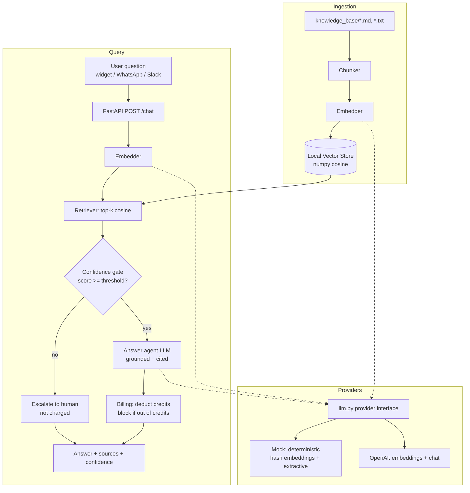

# 24/7 Support Chatbot Agent (RAG, autonomous, monetizable)

A production-grade **MVP** of an autonomous customer-support chatbot. It answers
questions **grounded in your knowledge base** using a Retrieval-Augmented
Generation (RAG) pipeline, **cites its sources**, returns a **confidence score**,
and **escalates to a human** instead of hallucinating when it isn't sure.

It runs **fully offline in mock mode** (no API keys) so you can verify the whole
pipeline, and swaps to OpenAI + Stripe by flipping environment variables.

---

## Why it's monetizable

- Deploys as a **webhook** (`POST /chat`) any website widget, WhatsApp, or Slack
  app can call — it runs unattended, 24/7.
- Built-in **credit / per-seat billing** with configurable margin over API cost.
- **Escalation gate** protects brand trust (no confident-sounding wrong answers)
  *and* is a selling point: **customers are only charged for answered messages.**

---

## Architecture



### Components

| File | Responsibility |
|------|----------------|
| `chatbot/config.py` | Env-driven configuration (provider, thresholds, pricing). |
| `chatbot/llm.py` | Provider interfaces: `Embedder` + `LLM`, with **OpenAI** and **Mock** implementations. |
| `chatbot/vectorstore.py` | Local numpy cosine vector store with JSON persistence (pure-Python fallback). |
| `chatbot/ingest.py` | Load → chunk → embed → index the knowledge base. |
| `chatbot/agent.py` | RAG answer agent + escalation / QA gate. |
| `chatbot/billing.py` | Credits, per-seat plans, cost/margin model, Stripe stub. |
| `app.py` | FastAPI webhook service (`/chat`, `/health`, `/billing/checkout`, `/account/{id}`). |
| `main.py` | CLI (`ingest`, `ask`, `chat`, `billing`). |
| `knowledge_base/` | Sample docs (Acme Cloud support content). |
| `tests/` | Pytest suite (all pass in mock mode). |

---

## Quick start (mock mode — no API keys)

```bash
cd support_chatbot_agent

# 1. (recommended) create a virtualenv and install deps
python3 -m venv .venv && source .venv/bin/activate
pip install -r requirements.txt

# 2. run in mock mode (default)
export LLM_PROVIDER=mock

# 3. build the index from the sample knowledge base
python main.py ingest

# 4. ask a grounded question
python main.py ask "How do I reset my password?"

# 5. see the escalation behaviour on an out-of-domain question
python main.py ask "What is the airspeed velocity of an unladen swallow?"

# 6. run the test suite
pytest
```

> **Minimal environments:** the pipeline only *needs* `numpy` (with a pure-Python
> cosine fallback if even that is missing). `fastapi`/`uvicorn` are only needed
> for the web service, and `openai`/`stripe` only for the production providers.

### Run the webhook service

```bash
uvicorn app:app --host 0.0.0.0 --port 8000
# then:
curl -s localhost:8000/chat -H 'content-type: application/json' \
  -d '{"question":"What is your refund policy?","account_id":"acme"}'
```

Example response:

```json
{
  "answer": "Based on our documentation: Our refund policy offers a 14-day money-back guarantee ...",
  "confidence": 0.52,
  "escalate": false,
  "sources": [{"source": "billing_and_plans.md", "score": 0.52, "snippet": "## Refund policy ..."}],
  "tokens_used": 394,
  "charged": true,
  "amount_charged": 0.0079,
  "remaining_credits": 0.9921
}
```

---

## Switching to production

### Option A — Open-source models via OpenRouter (recommended)

[OpenRouter](https://openrouter.ai) serves top open-weight chat models behind an
OpenAI-compatible API. For high-volume 24/7 support, cheap + fast wins, so this
is the recommended path. Embeddings stay **local** (offline hashed) by default,
so retrieval costs nothing.

```bash
LLM_PROVIDER=openrouter
OPENROUTER_API_KEY=sk-or-...            # https://openrouter.ai/keys
OPENROUTER_MODEL=deepseek/deepseek-v4-flash
EMBEDDING_BACKEND=local                 # or "openai" for hosted embeddings
```

| Model | Best for | ~Cost /1k in-out |
| --- | --- | --- |
| `deepseek/deepseek-v4-flash` *(default)* | cheapest, fast, high throughput | $0.00009 / $0.00018 |
| `meta-llama/llama-4-maverick` | best multilingual (incl. PT-BR) | $0.0002 / $0.0006 |
| `qwen/qwen-3-235b` | strong multilingual | $0.0002 / $0.0006 |

### Option B — OpenAI + Stripe

```bash
LLM_PROVIDER=openai
OPENAI_API_KEY=sk-...
# optional Stripe checkout
STRIPE_API_KEY=sk_live_...
STRIPE_PRICE_ID=price_...
```

Nothing else changes — the provider interfaces in `llm.py` swap the mock
implementations for the OpenRouter/OpenAI-backed ones automatically.

---

## Monetization model

Two revenue levers, combined:

### 1. Per-seat subscription (recurring)

| Plan | Price / seat / mo | Answer credits / seat | Seats |
|------|------------------:|----------------------:|------:|
| Free | $0 | $1 | 1 |
| Starter | $49 | $25 | 3 |
| Growth | $199 | $120 | 10 |
| Scale | $599 | $400 | 30 |

### 2. Usage / margin (per answered message)

- Each **answered** message estimates token usage and is billed at
  `PRICE_PER_1K_TOKENS` (default **$0.02/1k**), deducted from the account's
  credits.
- Our cost is `API_COST_PER_1K_TOKENS` (default **$0.005/1k**), so the built-in
  **gross margin is ~75%** on usage.
- **Escalated messages are not charged** — customers pay only for value
  delivered, which reduces churn and increases trust.
- When credits hit zero, the API returns **HTTP 402** and the CLI reports it —
  the account is blocked until top-up or upgrade.

Pricing can also be framed **per resolved conversation**: bundle N messages per
resolution and price the resolution above blended API cost — same engine, just a
different aggregation window.

Run `python main.py billing` to print the live cost model and margin example.

Stripe checkout is wired in `billing.create_checkout_session` and is **cleanly
disabled** (returns a descriptive stub) until `STRIPE_API_KEY` is set.

---

## How the escalation / QA gate works

1. The question is embedded and the top-k chunks are retrieved by cosine
   similarity.
2. **Confidence = the best retrieval similarity score.**
3. If confidence `< CONFIDENCE_THRESHOLD` (default `0.18`), the agent **escalates
   to a human** and does not generate an answer (and is not charged).
4. Otherwise the LLM answers **using only the retrieved context**, and the
   response includes the cited source chunks + scores.

The mock LLM is deliberately **extractive** — it can only stitch together
retrieved text, so the offline verification path is guaranteed grounded.

---

## Path to production

- **Vector store**: swap the JSON/numpy store for pgvector, Qdrant, or
  Pinecone (same `VectorStore` interface, add an `upsert`/ANN backend).
- **Persistence**: replace `InMemoryBillingStore` with Postgres; add Stripe
  webhooks for subscription lifecycle + metered usage reporting.
- **Ingestion**: add PDF/HTML loaders, incremental re-indexing, and a crawler
  for help-center URLs.
- **Quality**: add an LLM-as-judge QA step, answer citations verification, and
  feedback capture (thumbs up/down) to tune `CONFIDENCE_THRESHOLD`.
- **Channels**: thin adapters for the website widget, WhatsApp Business API, and
  Slack — all call the same `POST /chat` webhook.
- **Observability**: structured logging, per-account analytics, and rate limits.

---

## Tests

```bash
pytest
```

Covers ingestion + chunking, retrieval relevance, answer grounding, escalation
on low confidence, and billing (deduction, escalated-not-charged, and
out-of-credits blocking). All tests run in **mock mode** with no network access.
